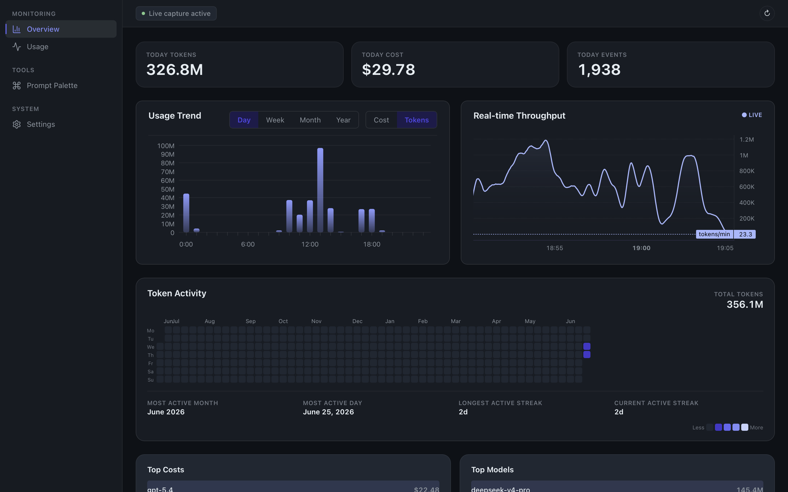
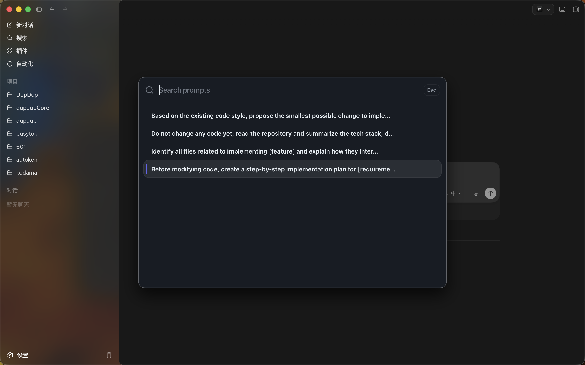

# Busytok

[](https://github.com/BalianWang/busytok/actions/workflows/verify.yml)
[](https://github.com/BalianWang/busytok/releases)
[](LICENSE)



**Busytok is a local-first agent token usage audit dashboard.** It reads local AI coding agent logs (Claude Code, Codex), normalizes low-sensitive token metadata, stores it in local SQLite, and serves GUI/CLI views through a local service.

Busytok does **not** proxy traffic, route models, inspect protocol payloads, install certificates, hook TLS, or handle OAuth/API keys/session tokens.

## Install (macOS)

### Homebrew (recommended)

```bash
brew install --cask busytok
```

Auto-updates are handled by the app's built-in updater. You can also `brew upgrade --cask busytok` to pull the latest version via Homebrew.

### Manual download

Download the latest universal DMG from [Releases](https://github.com/BalianWang/busytok/releases/latest) and drag `Busytok.app` to `/Applications`.

**Apple Silicon and Intel are both supported** by the universal binary.

### Stability contract

Busytok is `0.x`: real and usable, but **minors may break**. Auto-update is on for macOS (you'll get fixes without manual reinstall); on Windows, auto-update is not supported — reinstall manually from [Releases](https://github.com/BalianWang/busytok/releases/latest). Promote to `1.0` once the schema/migration story is stable and auto-update has run cleanly across at least three releases.

## What it does

- Reads local agent logs (Claude Code, Codex)
- Persists metadata-only token usage to local SQLite (no prompt/response bodies)
- Serves a desktop GUI (Dashboard, Agents, Settings pages) and a CLI (`busytok`)
- Bundles a background service (`busytok-service`) running as a launchd LaunchAgent

## Prompt Palette

Press **`Cmd+Option+K`** anywhere to open the prompt palette — a floating search window for saved prompts.

- **Save & reuse prompts** — write prompt templates with tags (alias, content, pin, tags) in the palette or Settings page. Use counts and last-used tracking help you find your most-used prompts.
- **One-key execution** — select a prompt and press `Enter` to execute your default action (configurable in Settings).
- **Three action modes** — **OnlyCopy** (clipboard only), **OnlyPaste** (paste without modifying your clipboard), **Copy & Paste** (write clipboard + paste). Choose your default in Settings → Prompt Palette.
- **Quick actions** — `⌘K` opens per-prompt actions (Copy, Paste, Edit, Delete, Toggle pin) from the palette.



## Workspace

- `apps/gui`: React + Tauri desktop application
- `apps/gui/src-tauri`: Tauri Rust host crate and bundle configuration
- `apps/service`: Rust background service
- `apps/cli`: Rust administrative CLI
- `crates/busytok-*`: Rust workspace crates

## Verification

- Local acceptance gate: `./scripts/verify_acceptance.sh`
- Release rehearsal: `DEVELOPER_ID_APPLICATION="Developer ID Application: ..." ./scripts/verify_release.sh`
- Naming check: `bash scripts/check-busytok-naming.sh`

## Contributing

See [`CONTRIBUTING.md`](CONTRIBUTING.md).

## Security

See [`SECURITY.md`](SECURITY.md). Report vulnerabilities via [GitHub Private Vulnerability Reporting](https://github.com/BalianWang/busytok/security/advisories/new).

## License

[Apache-2.0](LICENSE)
